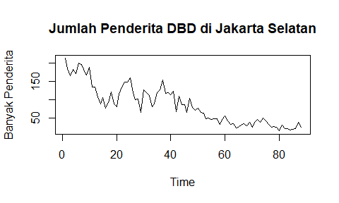
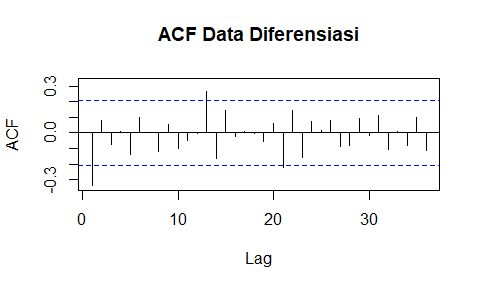
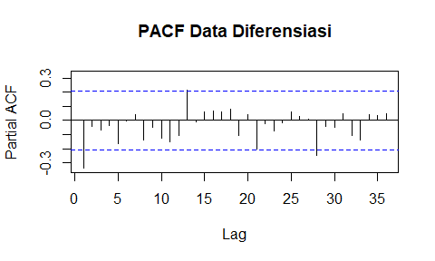
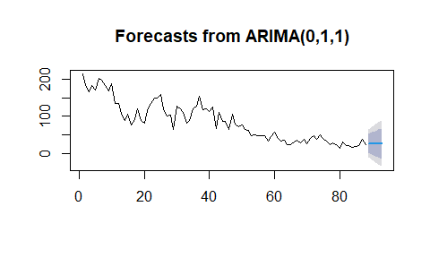
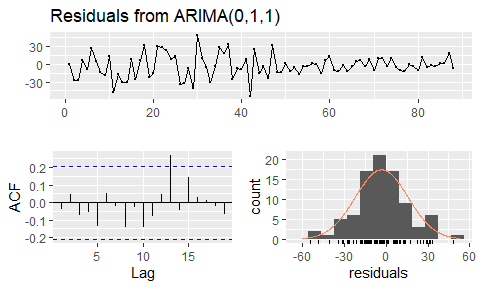

# Halo dan Selamat Datang !!  
Kali ini kita akan mencoba membangun model Deret Waktu **$ARIMA$** dengan menggunakan R Studio. Ada beberapa packages yang diperlukan  seperti berikut :  

# Packages    

```r
library(readr) # Membaca Data yang diinput
library(tseries) # Uji ADF
library(timeSeries) # Mengolah Data yang akan digunakan
library(lmtest) # Mengecek signifikansi model
library(forecast) #Membuat prediksi
```

# Basic EDA (Exploratory Data Analysis)  

```r
data <- read_delim("Data/Penderita DBD Jakarta Selatan.csv", 
    ";", escape_double = FALSE, trim_ws = TRUE)
```

```
## 
## -- Column specification --------------------------------------------------------
## cols(
##   Tahun = col_double(),
##   `Jumlah Penderita` = col_double()
## )
```

```r
ts_data <- ts(data$`Jumlah Penderita`)
plot(ts_data, main = 'Jumlah Penderita DBD di Jakarta Selatan', 
     ylab='Banyak Penderita', type = 'o')
```

<!-- -->
Dalam membuat model $ARIMA$ langkah pertama yang harus dilakukan adalah dengan menguji kestasioneran data. Ada beberapa cara yang dapat digunakan tapi untuk kali ini akan digunakan uji ADF (Augmented Dickey-Fuller) 

```r
adf.test(ts_data)
```

```
## 
## 	Augmented Dickey-Fuller Test
## 
## data:  ts_data
## Dickey-Fuller = -3.1021, Lag order = 4, p-value = 0.1229
## alternative hypothesis: stationary
```
Perhatikan bahwa $p_{value} >\alpha = 0.05$ yang berarti bahwa data yang kita miliki **tidak stasioner** maka dari itu perlu dilakukan diferensiasi kemudian akan diuji kembali apakah sudah stasioner atau belum.  

```r
diff_data <- diff(ts_data)
adf.test(diff_data)
```

```
## Warning in adf.test(diff_data): p-value smaller than printed p-value
```

```
## 
## 	Augmented Dickey-Fuller Test
## 
## data:  diff_data
## Dickey-Fuller = -5.264, Lag order = 4, p-value = 0.01
## alternative hypothesis: stationary
```
Perhatikan bahwa $p_{value} < \alpha = 0.05$ yang berarti bahwa data yang kita miliki sudah **stasioner**. Berikutnya membuat grafik ACF dan PACF dari data yang sudah di diferensiasi.  

```r
Acf(diff_data, lag.max=36, main = 'ACF Data Diferensiasi')
```

<!-- -->

```r
Pacf(diff_data, lag.max=36, main = 'PACF Data Diferensiasi')
```

<!-- -->
Dapat dilihat bahwa pada plot ACF dan PACF bahwa lag-1 signifikan sehingga dapat disimpulkan model-model yang mungkin adalah,  
  
1. $ARIMA (1,1,1)$  
2. $ARIMA (1,1,0)$  
3. $ARIMA (0,1,1)$  

# Model Fitting  
Berikutnya akan dibangun model hasil analisis sebelumnya   

```r
model_1 <- arima(ts_data, order = c(1,1,1))
summary(model_1)
```

```
## 
## Call:
## arima(x = ts_data, order = c(1, 1, 1))
## 
## Coefficients:
##           ar1      ma1
##       -0.2240  -0.1237
## s.e.   0.3703   0.3860
## 
## sigma^2 estimated as 362.5:  log likelihood = -379.86,  aic = 765.72
## 
## Training set error measures:
##                     ME    RMSE      MAE       MPE     MAPE      MASE
## Training set -2.907863 18.9322 14.67332 -6.927245 20.12045 0.9671053
##                     ACF1
## Training set -0.01610403
```

```r
model_2 <- arima(ts_data, order = c(1,1,0))
summary(model_2)
```

```
## 
## Call:
## arima(x = ts_data, order = c(1, 1, 0))
## 
## Coefficients:
##           ar1
##       -0.3339
## s.e.   0.1018
## 
## sigma^2 estimated as 363:  log likelihood = -379.91,  aic = 763.83
## 
## Training set error measures:
##                     ME     RMSE      MAE      MPE     MAPE      MASE
## Training set -2.778949 18.94393 14.67724 -6.70485 20.11616 0.9673638
##                     ACF1
## Training set -0.02620326
```

```r
model_3 <- arima(ts_data, order = c(0,1,1))
summary(model_3)
```

```
## 
## Call:
## arima(x = ts_data, order = c(0, 1, 1))
## 
## Coefficients:
##           ma1
##       -0.3369
## s.e.   0.1013
## 
## sigma^2 estimated as 363.9:  log likelihood = -380.02,  aic = 764.03
## 
## Training set error measures:
##                     ME     RMSE      MAE       MPE     MAPE      MASE
## Training set -3.140308 18.96647 14.64604 -7.367122 20.21358 0.9653073
##                     ACF1
## Training set -0.03612672
```

```r
mod_auto = auto.arima(ts_data, max.p=4,max.q=4,stepwise = TRUE)
summary(mod_auto)
```

```
## Series: ts_data 
## ARIMA(0,1,1) with drift 
## 
## Coefficients:
##           ma1    drift
##       -0.3711  -2.0173
## s.e.   0.1056   1.2778
## 
## sigma^2 estimated as 362.4:  log likelihood=-378.85
## AIC=763.69   AICc=763.98   BIC=771.09
## 
## Training set error measures:
##                      ME     RMSE      MAE       MPE     MAPE      MASE
## Training set -0.1551624 18.70988 14.14675 -1.655593 18.56212 0.9323994
##                     ACF1
## Training set 0.001671315
```
Dapat dilihat bahwa mod_auto adalah model dengan AIC yang paling rendah dan memiliki Error yang paling rendah sehingga akan kita gunakan mod_auto $ARIMA_\mu(0,1,1)$ dengan drift. Berikutnya akan dilihat signifikansi dari koefisiennya.   

```r
coeftest(mod_auto)
```

```
## 
## z test of coefficients:
## 
##       Estimate Std. Error z value  Pr(>|z|)    
## ma1   -0.37113    0.10561 -3.5140 0.0004415 ***
## drift -2.01733    1.27778 -1.5788 0.1143855    
## ---
## Signif. codes:  0 '***' 0.001 '**' 0.01 '*' 0.05 '.' 0.1 ' ' 1
```
Dapat dilihat ternyata koefisien drift tidak signifikan sehingga akan digunakan model $ARIMA(0,1,1)$ dan akan diperiksa kembali apakah koefisiennya signifikan atau tidak.  

```r
coeftest(model_3)
```

```
## 
## z test of coefficients:
## 
##     Estimate Std. Error z value  Pr(>|z|)    
## ma1 -0.33687    0.10126 -3.3268 0.0008784 ***
## ---
## Signif. codes:  0 '***' 0.001 '**' 0.01 '*' 0.05 '.' 0.1 ' ' 1
```
Karna koefisien signifikan maka model yang akan digunakan adalah $ARIMA(0,1,1)$.  
# Forecasting  
Berikutnya akan kita gunakan model yang telah dibuat untuk memprediksi model.  

```r
h <-forecast(model_3, h = 5)
plot(h)
```

<!-- -->
# Uji Diagnostik  

```r
checkresiduals(model_3)
```

<!-- -->

```
## 
## 	Ljung-Box test
## 
## data:  Residuals from ARIMA(0,1,1)
## Q* = 7.2342, df = 9, p-value = 0.6128
## 
## Model df: 1.   Total lags used: 10
```
Dapat dilihat dari grafik residual bahwa dapat dikatakan bahwa galat sudah berdistribusi normal.  

# Kesimpulan  
Model yang digunakan untuk memodelkan DBD di Jakarta Selatan $ARIMA(0,1,1)$ 
