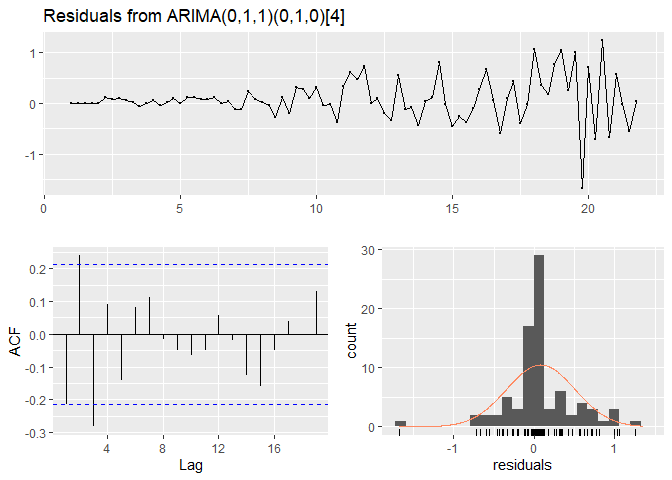

Tes Akhir 3 - Senin
================

# Non Logaritma

## Pre-Processing

### Library

``` r
library(tseries)
```

    ## Registered S3 method overwritten by 'quantmod':
    ##   method            from
    ##   as.zoo.data.frame zoo

``` r
library(forecast)
library(lmtest)
```

    ## Loading required package: zoo

    ## 
    ## Attaching package: 'zoo'

    ## The following objects are masked from 'package:base':
    ## 
    ##     as.Date, as.Date.numeric

``` r
library(readxl)
```

### Input Data

``` r
Data <- read_excel("Data/Data.xlsx")
ts_data <- ts(Data$Saham)
plot(ts_data, main ='Data Time Series')
```

<!-- -->

``` r
Acf(ts_data, main = 'Plot ACF Data')
```

<!-- -->

``` r
adf.test(ts_data)
```

    ## Warning in adf.test(ts_data): p-value greater than printed p-value

    ## 
    ##  Augmented Dickey-Fuller Test
    ## 
    ## data:  ts_data
    ## Dickey-Fuller = 1.9321, Lag order = 4, p-value = 0.99
    ## alternative hypothesis: stationary

Perhatikan bahwa pada Plot ACF tersebut belum menandakan adanya pengaruh
seasonal. Karena datanya juga non-stasioner (dari ACF dan ADF Test),
maka akan didiferensiasi.

### Processing

``` r
diff_ts <- diff(ts_data)
Acf(diff_ts,lag.max = 48, main = 'ACF Data Differensiasi')
```

<!-- -->

``` r
Pacf(diff_ts,lag.max = 48, main = 'PACF Data Differensiasi')
```

<!-- -->
Perhatikan pada plot ACF bahwa setiap lag ke-4 selalu signifikan maka
akan dicoba di diferensiasi pada seasonal 4.

``` r
diff_ts_seasonal <- diff(diff_ts, lag = 4)
Acf(diff_ts_seasonal,lag.max = 48, main = 'ACF Data Differensiasi Musiman')
```

<!-- -->

``` r
Pacf(diff_ts_seasonal,lag.max = 48, main = 'PACF Data Differensiasi Musiman')
```

<!-- --> Dapat
dilihat bahwa grafik ACF signifikan pada lag 1 - 4 dan PACF pada lag 1.
Sehingga model yang mungkin adalah :

1.  \(SARIMA(1,1,1) \times (0,1,1)_{4}\)  
2.  \(SARIMA(2,1,1) \times (0,1,1)_{4}\)  
3.  \(SARIMA(3,1,1) \times (0,1,1)_{4}\)

### Modelling

``` r
ts_data <- ts(Data$Saham, frequency = 4) # Tidak Perlu jika sudah di declare di awal

model_1 <- arima(ts_data, order = c(1,1,1),seasonal = list(order= c(0,1,1), period = 4))
summary(model_1)
```

    ## 
    ## Call:
    ## arima(x = ts_data, order = c(1, 1, 1), seasonal = list(order = c(0, 1, 1), period = 4))
    ## 
    ## Coefficients:
    ##           ar1      ma1     sma1
    ##       -0.3240  -0.5937  -0.0264
    ## s.e.   0.1947   0.1797   0.1347
    ## 
    ## sigma^2 estimated as 0.1859:  log likelihood = -46.09,  aic = 100.17
    ## 
    ## Training set error measures:
    ##                     ME      RMSE       MAE      MPE     MAPE      MASE
    ## Training set 0.0634787 0.4181144 0.2770394 1.962432 6.684761 0.3550691
    ##                    ACF1
    ## Training set 0.01558873

``` r
model_2 <- arima(ts_data, order = c(2,1,1),seasonal = list(order= c(0,1,1), period = 4))
summary(model_2)
```

    ## 
    ## Call:
    ## arima(x = ts_data, order = c(2, 1, 1), seasonal = list(order = c(0, 1, 1), period = 4))
    ## 
    ## Coefficients:
    ##           ar1     ar2      ma1    sma1
    ##       -0.0706  0.2818  -0.8022  0.0291
    ## s.e.   0.1734  0.1468   0.1141  0.1314
    ## 
    ## sigma^2 estimated as 0.1776:  log likelihood = -44.29,  aic = 98.58
    ## 
    ## Training set error measures:
    ##                      ME      RMSE       MAE      MPE     MAPE      MASE
    ## Training set 0.07308055 0.4086726 0.2651209 2.155401 6.417651 0.3397936
    ##                       ACF1
    ## Training set -0.0001241164

``` r
model_3 <- arima(ts_data, order = c(3,1,1),seasonal = list(order= c(0,1,1), period = 4))
summary(model_3)
```

    ## 
    ## Call:
    ## arima(x = ts_data, order = c(3, 1, 1), seasonal = list(order = c(0, 1, 1), period = 4))
    ## 
    ## Coefficients:
    ##           ar1     ar2      ar3      ma1    sma1
    ##       -0.1539  0.1484  -0.2059  -0.6776  0.0179
    ## s.e.   0.2326  0.1866   0.1220   0.1939  0.1657
    ## 
    ## sigma^2 estimated as 0.1716:  log likelihood = -43,  aic = 98
    ## 
    ## Training set error measures:
    ##                      ME      RMSE       MAE      MPE     MAPE      MASE
    ## Training set 0.07114275 0.4017031 0.2608726 2.134648 6.296729 0.3343488
    ##                     ACF1
    ## Training set -0.05279787

``` r
model_auto <- auto.arima(ts_data, seasonal = TRUE)
summary(model_auto)
```

    ## Series: ts_data 
    ## ARIMA(3,1,1)(0,1,0)[4] 
    ## 
    ## Coefficients:
    ##           ar1     ar2     ar3      ma1
    ##       -0.1712  0.1387  -0.208  -0.6636
    ## s.e.   0.1769  0.1701   0.121   0.1542
    ## 
    ## sigma^2 estimated as 0.1808:  log likelihood=-43.01
    ## AIC=96.02   AICc=96.84   BIC=107.86
    ## 
    ## Training set error measures:
    ##                      ME      RMSE       MAE      MPE     MAPE      MASE
    ## Training set 0.07105453 0.4017401 0.2612646 2.132271 6.297105 0.3723708
    ##                     ACF1
    ## Training set -0.05098989

Dapat dilihat bahwa model \(SARIMA(3,1,1)\times (0,1,0)_{4}\) memiliki
AIC paling rendah dengan error yang tidak jauh berbeda dari yang lain.
Model yang dapat dipilih adalah \(SARIMA(3,1,1)\times (0,1,1)_{4}\),
\(SARIMA(2,1,1)\times (0,1,1)_{4}\) dan
\(SARIMA(3,1,1)\times (0,1,1)_{4}\). Berikutnya akan dilihat
signifikansi dari parameter.

``` r
coeftest(model_2)
```

    ## 
    ## z test of coefficients:
    ## 
    ##       Estimate Std. Error z value  Pr(>|z|)    
    ## ar1  -0.070555   0.173398 -0.4069    0.6841    
    ## ar2   0.281814   0.146803  1.9197    0.0549 .  
    ## ma1  -0.802176   0.114100 -7.0305 2.058e-12 ***
    ## sma1  0.029056   0.131350  0.2212    0.8249    
    ## ---
    ## Signif. codes:  0 '***' 0.001 '**' 0.01 '*' 0.05 '.' 0.1 ' ' 1

``` r
coeftest(model_3)
```

    ## 
    ## z test of coefficients:
    ## 
    ##       Estimate Std. Error z value  Pr(>|z|)    
    ## ar1  -0.153884   0.232581 -0.6616 0.5082030    
    ## ar2   0.148425   0.186578  0.7955 0.4263169    
    ## ar3  -0.205937   0.121962 -1.6885 0.0913075 .  
    ## ma1  -0.677590   0.193949 -3.4937 0.0004765 ***
    ## sma1  0.017887   0.165744  0.1079 0.9140590    
    ## ---
    ## Signif. codes:  0 '***' 0.001 '**' 0.01 '*' 0.05 '.' 0.1 ' ' 1

``` r
coeftest(model_auto)
```

    ## 
    ## z test of coefficients:
    ## 
    ##     Estimate Std. Error z value Pr(>|z|)    
    ## ar1 -0.17121    0.17688 -0.9680  0.33305    
    ## ar2  0.13867    0.17011  0.8152  0.41498    
    ## ar3 -0.20803    0.12103 -1.7188  0.08566 .  
    ## ma1 -0.66355    0.15419 -4.3036 1.68e-05 ***
    ## ---
    ## Signif. codes:  0 '***' 0.001 '**' 0.01 '*' 0.05 '.' 0.1 ' ' 1

Dapat dilihat bahwa model ini signifikan hanya pada
\(SARIMA(0,1,1)\times(0,1,0)\) sehingga akan dicoba untuk memodelkan
ulang :

``` r
model_ma <- arima(ts_data, order = c(0,1,1),seasonal = list(order= c(0,1,0), period = 4))
summary(model_ma)
```

    ## 
    ## Call:
    ## arima(x = ts_data, order = c(0, 1, 1), seasonal = list(order = c(0, 1, 0), period = 4))
    ## 
    ## Coefficients:
    ##           ma1
    ##       -0.7623
    ## s.e.   0.0634
    ## 
    ## sigma^2 estimated as 0.1955:  log likelihood = -48.06,  aic = 100.13
    ## 
    ## Training set error measures:
    ##                      ME      RMSE       MAE     MPE     MAPE      MASE
    ## Training set 0.08111189 0.4288119 0.2786262 2.35776 6.512691 0.3571028
    ##                   ACF1
    ## Training set -0.215579

``` r
coeftest(model_ma)
```

    ## 
    ## z test of coefficients:
    ## 
    ##      Estimate Std. Error z value  Pr(>|z|)    
    ## ma1 -0.762269   0.063442 -12.015 < 2.2e-16 ***
    ## ---
    ## Signif. codes:  0 '***' 0.001 '**' 0.01 '*' 0.05 '.' 0.1 ' ' 1

Ternyata model \(SARIMA(0,1,1)\times (0,1,0)_{4}\) memiliki performa
yang jauh lebih baik dari yang lain. Sehingga model ini akan digunakan
ke depannya. Akan dilihat Residual dari model ini

``` r
checkresiduals(model_ma)
```

<!-- -->

    ## 
    ##  Ljung-Box test
    ## 
    ## data:  Residuals from ARIMA(0,1,1)(0,1,0)[4]
    ## Q* = 20.561, df = 7, p-value = 0.004477
    ## 
    ## Model df: 1.   Total lags used: 8

Dari error/galat dapat dilihat bahwa datanya tidak terlalu berdistribusi
normal maupun saling bebas. Sehingga galat dari model tersebut dapat
dimodelkan dengan model Heteroskedastis untuk memperoleh prediksi yang
lebih baik. Tapi untuk topik kali ini cukup sampai model
\(SARIMA(0,1,1)\times (0,1,0)_{4}\).

### Forecasting

``` r
fc <- forecast(model_ma)
plot(fc)
```

<!-- -->

### Kesimpulan

Model terbaik untuk harga saham \(SARIMA(0,1,1)\times (0,1,0)_{4}\).

# Log

## Pre-Processing

### Library

``` r
library(tseries)
library(forecast)
library(lmtest)
library(readxl)
```

### Input Data

``` r
Data <- read_excel("Data/Data.xlsx")
ts_data <- ts(log(Data$Saham))
plot(ts_data, main ='Data Time Series')
```

<!-- -->

``` r
Acf(ts_data, main = 'Plot ACF Data')
```

<!-- -->

``` r
adf.test(ts_data)
```

    ## 
    ##  Augmented Dickey-Fuller Test
    ## 
    ## data:  ts_data
    ## Dickey-Fuller = -1.1543, Lag order = 4, p-value = 0.9087
    ## alternative hypothesis: stationary

Perhatikan bahwa pada Plot ACF tersebut belum menandakan adanya pengaruh
seasonal. Karena datanya juga non-stasioner (dari ACF dan ADF Test),
maka akan didiferensiasi.

### Processing

``` r
diff_ts <- diff(ts_data)
Acf(diff_ts,lag.max = 48, main = 'ACF Data Differensiasi')
```

<!-- -->

``` r
Pacf(diff_ts,lag.max = 48, main = 'PACF Data Differensiasi')
```

<!-- -->
Perhatikan pada plot ACF bahwa setiap lag ke-4 selalu signifikan maka
akan dicoba di diferensiasi pada seasonal 4.

``` r
diff_ts_seasonal <- diff(diff_ts, lag = 4)
Acf(diff_ts_seasonal,lag.max = 48, main = 'ACF Data Differensiasi Musiman')
```

<!-- -->

``` r
Pacf(diff_ts_seasonal,lag.max = 48, main = 'PACF Data Differensiasi Musiman')
```

<!-- -->
Dapat dilihat bahwa grafik ACF signifikan pada lag 1 dan PACF pada lag
1. Sehingga model yang mungkin adalah :

1.  \(SARIMA(1,1,1) \times (0,1,0)_4\)  
2.  \(SARIMA(0,1,1) \times (0,1,0)_4\)  
3.  \(SARIMA(1,1,0) \times (0,1,0)_4\)

### Modelling

``` r
ts_data <- ts(log(Data$Saham), frequency = 4) # Tidak Perlu jika sudah di declare di awal

model_1 <- arima(ts_data, order = c(1,1,1),seasonal = list(order= c(0,1,0), period = 4))
summary(model_1)
```

    ## 
    ## Call:
    ## arima(x = ts_data, order = c(1, 1, 1), seasonal = list(order = c(0, 1, 0), period = 4))
    ## 
    ## Coefficients:
    ##          ar1      ma1
    ##       0.2384  -0.8891
    ## s.e.  0.1518   0.0958
    ## 
    ## sigma^2 estimated as 0.008444:  log likelihood = 75.91,  aic = -145.83
    ## 
    ## Training set error measures:
    ##                      ME       RMSE        MAE MPE MAPE     MASE        ACF1
    ## Training set 0.01065515 0.08911663 0.06996632 Inf  Inf 0.419781 0.005137968

``` r
model_2 <- arima(ts_data, order = c(0,1,1),seasonal = list(order= c(0,1,0), period = 4))
summary(model_2)
```

    ## 
    ## Call:
    ## arima(x = ts_data, order = c(0, 1, 1), seasonal = list(order = c(0, 1, 0), period = 4))
    ## 
    ## Coefficients:
    ##           ma1
    ##       -0.7666
    ## s.e.   0.1107
    ## 
    ## sigma^2 estimated as 0.008724:  log likelihood = 74.76,  aic = -145.51
    ## 
    ## Training set error measures:
    ##                       ME       RMSE        MAE MPE MAPE      MASE      ACF1
    ## Training set 0.008318837 0.09058006 0.07068838 Inf  Inf 0.4241133 0.1623547

``` r
model_3 <- arima(ts_data, order = c(1,1,0),seasonal = list(order= c(0,1,0), period = 4))
summary(model_3)
```

    ## 
    ## Call:
    ## arima(x = ts_data, order = c(1, 1, 0), seasonal = list(order = c(0, 1, 0), period = 4))
    ## 
    ## Coefficients:
    ##           ar1
    ##       -0.4614
    ## s.e.   0.1030
    ## 
    ## sigma^2 estimated as 0.009453:  log likelihood = 71.91,  aic = -139.82
    ## 
    ## Training set error measures:
    ##                       ME       RMSE        MAE MPE MAPE      MASE         ACF1
    ## Training set 0.004522581 0.09428613 0.07583031 NaN  Inf 0.4549636 -0.005187993

``` r
model_auto <- auto.arima(ts_data, seasonal = TRUE)
summary(model_auto)
```

    ## Series: ts_data 
    ## ARIMA(2,0,0)(1,1,0)[4] with drift 
    ## 
    ## Coefficients:
    ##          ar1     ar2     sar1   drift
    ##       0.2686  0.2855  -0.2695  0.0382
    ## s.e.  0.1137  0.1214   0.1212  0.0042
    ## 
    ## sigma^2 estimated as 0.007793:  log likelihood=82.47
    ## AIC=-154.95   AICc=-154.14   BIC=-143.04
    ## 
    ## Training set error measures:
    ##                       ME       RMSE        MAE MPE MAPE      MASE        ACF1
    ## Training set 0.002030151 0.08396647 0.06504478 NaN  Inf 0.4058742 -0.03591245

Dapat dilihat bahwa model \(SARIMA(2,0,0)\times (1,1,0)_{4}\) memiliki
AIC paling rendah dengan error yang tidak jauh berbeda dari yang lain
hanya saja model ini tentu dapat ditolak dengan alasan bahwa model
memiliki trend naik yang mengakibatkan data tersebut sudah pasti tidak
stasioner. Sehingga model yang dapat dipilih hanya
\(SARIMA(1,1,1)\times (0,1,0)_{4}\). Berikutnya akan dilihat
signifikansi dari parameter.

``` r
coeftest(model_1)
```

    ## 
    ## z test of coefficients:
    ## 
    ##      Estimate Std. Error z value Pr(>|z|)    
    ## ar1  0.238382   0.151819  1.5702   0.1164    
    ## ma1 -0.889094   0.095809 -9.2798   <2e-16 ***
    ## ---
    ## Signif. codes:  0 '***' 0.001 '**' 0.01 '*' 0.05 '.' 0.1 ' ' 1

``` r
coeftest(model_auto)
```

    ## 
    ## z test of coefficients:
    ## 
    ##         Estimate Std. Error z value Pr(>|z|)    
    ## ar1    0.2686184  0.1137457  2.3616  0.01820 *  
    ## ar2    0.2854684  0.1213954  2.3516  0.01869 *  
    ## sar1  -0.2694972  0.1211961 -2.2236  0.02617 *  
    ## drift  0.0381617  0.0042407  8.9990  < 2e-16 ***
    ## ---
    ## Signif. codes:  0 '***' 0.001 '**' 0.01 '*' 0.05 '.' 0.1 ' ' 1

Dapat dilihat bahwa model ini signifikan hanya pada
\(SARIMA(1,1,1)\times(0,1,0)\) sehingga akan dicoba untuk memodelkan
ulang :

``` r
model_ma <- arima(ts_data, order = c(0,1,1),seasonal = list(order= c(0,1,0), period = 4))
summary(model_ma)
```

    ## 
    ## Call:
    ## arima(x = ts_data, order = c(0, 1, 1), seasonal = list(order = c(0, 1, 0), period = 4))
    ## 
    ## Coefficients:
    ##           ma1
    ##       -0.7666
    ## s.e.   0.1107
    ## 
    ## sigma^2 estimated as 0.008724:  log likelihood = 74.76,  aic = -145.51
    ## 
    ## Training set error measures:
    ##                       ME       RMSE        MAE MPE MAPE      MASE      ACF1
    ## Training set 0.008318837 0.09058006 0.07068838 Inf  Inf 0.4241133 0.1623547

``` r
coeftest(model_ma)
```

    ## 
    ## z test of coefficients:
    ## 
    ##     Estimate Std. Error z value  Pr(>|z|)    
    ## ma1 -0.76664    0.11069  -6.926 4.329e-12 ***
    ## ---
    ## Signif. codes:  0 '***' 0.001 '**' 0.01 '*' 0.05 '.' 0.1 ' ' 1

Ternyata model \(SARIMA(0,1,1)\times (0,1,0)_{4}\) memiliki performa
yang jauh lebih baik dari yang lain. Sehingga model ini akan digunakan
ke depannya. Akan dilihat Residual dari model ini

``` r
checkresiduals(model_ma)
```

<!-- -->

    ## 
    ##  Ljung-Box test
    ## 
    ## data:  Residuals from ARIMA(0,1,1)(0,1,0)[4]
    ## Q* = 17.939, df = 7, p-value = 0.01225
    ## 
    ## Model df: 1.   Total lags used: 8

Dari error/galat dapat dilihat bahwa datanya lebih terlihat
berdistribusi normal hanya saja masih belum terlalu terlihat galatnya
saling bebas.

### Forecasting

``` r
fc <- forecast(model_ma)
plot(fc)
```

<!-- -->

### Kesimpulan

Model terbaik untuk memodelkan log dari harga saham tersebut adalah
\(SARIMA(0,1,1)\times (0,1,0)_{4}\).
